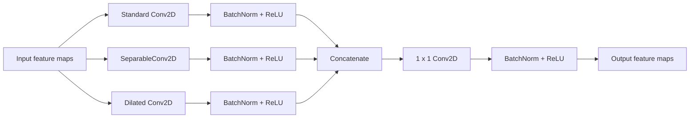
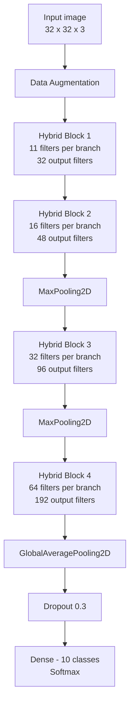

# Custom Hybrid CNN for CIFAR-10

This project presents a custom **Hybrid Convolutional Neural Network (CNN)** for image classification on the **CIFAR-10** dataset.

The proposed architecture combines three different convolution types inside each hybrid block:

- Standard convolution
- Depthwise separable convolution
- Dilated convolution

The goal is to investigate whether combining different convolution operations can improve classification performance compared with models that use only one convolution type.

The proposed **Hybrid CNN** is compared with three baseline architectures:

- Standard CNN
- Depthwise CNN
- Dilated CNN

---

## Dataset

The project uses the **CIFAR-10** dataset.

CIFAR-10 contains **60,000 RGB images** with a resolution of **32 × 32 pixels**, divided into 10 classes:

- airplane
- automobile
- bird
- cat
- deer
- dog
- frog
- horse
- ship
- truck

The original dataset contains:

- 50,000 training images
- 10,000 test images

For this project, the original training set is additionally divided into:

| Dataset split | Number of images |
|---|---:|
| Training | 45,000 |
| Validation | 5,000 |
| Test | 10,000 |

The split is performed using a fixed random seed (`SEED = 42`) and stratification to preserve the class distribution.

Pixel values are normalized to the range `[0, 1]`.

---

## Data Augmentation

Data augmentation is applied during training in order to improve generalization.

The following transformations are used:

- Random horizontal flip
- Random translation up to 10% horizontally and vertically

```python
layers.RandomFlip("horizontal")
layers.RandomTranslation(
    0.1,
    0.1,
    fill_mode="reflect"
)
```

The transformations are applied only during training.

---

# Model Architectures

Four CNN architectures are evaluated using the same training and evaluation procedure.

## 1. Standard CNN

The Standard CNN uses regular `Conv2D` layers.

Architecture:

```text
Input (32 × 32 × 3)
        │
        ▼
Data Augmentation
        │
        ▼
Conv2D - 32 filters
Batch Normalization
ReLU
        │
        ▼
Conv2D - 48 filters
Batch Normalization
ReLU
        │
        ▼
Max Pooling
        │
        ▼
Conv2D - 96 filters
Batch Normalization
ReLU
        │
        ▼
Max Pooling
        │
        ▼
Conv2D - 192 filters
Batch Normalization
ReLU
        │
        ▼
Global Average Pooling
        │
        ▼
Dropout (0.3)
        │
        ▼
Dense (10, Softmax)
```

---

## 2. Depthwise CNN

The Depthwise CNN has a structure similar to the Standard CNN, but replaces regular convolutions with **depthwise separable convolutions** implemented using `SeparableConv2D`.

Depthwise separable convolutions significantly reduce the number of model parameters.

```text
Input
  │
  ▼
SeparableConv2D - 32
  │
  ▼
SeparableConv2D - 48
  │
  ▼
Max Pooling
  │
  ▼
SeparableConv2D - 96
  │
  ▼
Max Pooling
  │
  ▼
SeparableConv2D - 192
  │
  ▼
Global Average Pooling
  │
  ▼
Dropout
  │
  ▼
Softmax Classification
```

---

## 3. Dilated CNN

The Dilated CNN uses **dilated convolutions** with a dilation rate of 2.

Dilated convolutions increase the receptive field without increasing the kernel size.

```text
Input
  │
  ▼
Dilated Conv2D - 32
  │
  ▼
Dilated Conv2D - 48
  │
  ▼
Max Pooling
  │
  ▼
Dilated Conv2D - 96
  │
  ▼
Max Pooling
  │
  ▼
Dilated Conv2D - 192
  │
  ▼
Global Average Pooling
  │
  ▼
Dropout
  │
  ▼
Softmax Classification
```

---

# Proposed Hybrid CNN

The main contribution of the project is a custom **Hybrid CNN architecture**.

Instead of selecting only one convolution type, each hybrid block processes the same input through three parallel branches:

1. Standard convolution
2. Depthwise separable convolution
3. Dilated convolution

The outputs of the three branches are concatenated.

A `1 × 1` convolution is then used to combine the extracted features and control the number of output feature maps.

---

## Hybrid Block



Each convolution branch extracts features in a different way:

- **Standard convolution** learns regular spatial features.
- **Depthwise separable convolution** extracts features using fewer parameters.
- **Dilated convolution** increases the receptive field and captures information from a larger spatial region.

The `1 × 1` convolution learns how to combine the information produced by all three branches.

---

## Complete Hybrid CNN Architecture



The first hybrid block uses a dilation rate of 1, while the remaining hybrid blocks use a dilation rate of 2.

---

## Hybrid CNN Feature Flow

The basic idea of the proposed architecture can also be represented as:

```text
                          ┌───────────────────────┐
                          │   Standard Conv2D     │
                          └───────────┬───────────┘
                                      │
                                      │
Input feature maps ───────────────────┼───────────────┐
                                      │               │
                          ┌───────────▼───────────┐   │
                          │ Separable Conv2D      │   │
                          └───────────┬───────────┘   │
                                      │               │
                                      │               │
                          ┌───────────▼───────────┐   │
                          │ Dilated Conv2D        │   │
                          └───────────┬───────────┘   │
                                      │               │
                                      ▼               │
                               Concatenation ◄────────┘
                                      │
                                      ▼
                                  1 × 1 Conv
                                      │
                                      ▼
                              Combined features
```

---

# Training Configuration

All four models are trained using the same training configuration to provide a consistent comparison.

| Parameter | Value |
|---|---|
| Optimizer | Adam |
| Initial learning rate | 0.001 |
| Batch size | 128 |
| Maximum epochs | 50 |
| Loss function | Sparse categorical crossentropy |
| Random seed | 42 |
| Dropout | 0.3 |

Two callbacks are used during training.

### ReduceLROnPlateau

The learning rate is reduced when the validation loss stops improving.

```text
factor = 0.5
patience = 4
minimum learning rate = 1e-6
```

### EarlyStopping

Training is stopped when validation loss does not improve for several epochs.

```text
patience = 8
restore_best_weights = True
```

This means that training can stop before reaching all 50 epochs.

---

# Evaluation Metrics

The models are evaluated using:

- Test loss
- Accuracy
- Macro precision
- Macro recall
- Macro F1-score
- Number of trainable and non-trainable parameters
- Training time
- Average prediction time per image

A classification report and confusion matrix are also generated for each model.

Macro averaging is used for precision, recall, and F1-score so that all CIFAR-10 classes contribute equally to the final metric.

---

# Results

The following results were obtained during the final experiment:

| Model | Test Loss | Accuracy | Precision | Recall | F1-score | Parameters | Training Time (s) | Prediction Time / Image (ms) |
|---|---:|---:|---:|---:|---:|---:|---:|---:|
| StandardCNN | 0.5455 | 81.37% | 81.50% | 81.37% | 81.35% | 225,450 | 490.87 | 0.0835 |
| DepthwiseCNN | 0.7642 | 73.39% | 73.31% | 73.39% | 72.99% | 29,685 | 437.75 | 0.1073 |
| DilatedCNN | 0.5686 | 80.79% | 80.75% | 80.79% | 80.62% | 225,450 | 667.66 | 0.1586 |
| **HybridCNN** | **0.4182** | **86.18%** | **86.24%** | **86.18%** | **86.15%** | **212,204** | **1117.93** | **0.1285** |

---

## Accuracy Comparison

The proposed Hybrid CNN achieved the highest test accuracy:

```text
Hybrid CNN       86.18%
Standard CNN     81.37%
Dilated CNN      80.79%
Depthwise CNN    73.39%
```

Compared with the Standard CNN, the Hybrid CNN improved the test accuracy by:

```text
86.18% - 81.37% = 4.81 percentage points
```

---

## F1-score Comparison

```text
Hybrid CNN       86.15%
Standard CNN     81.35%
Dilated CNN      80.62%
Depthwise CNN    72.99%
```

The Hybrid CNN also achieved the highest macro F1-score.

---

## Number of Parameters

```text
Standard CNN     225,450
Dilated CNN      225,450
Hybrid CNN       212,204
Depthwise CNN     29,685
```

An important result is that the Hybrid CNN achieved better classification performance than the Standard CNN while using fewer parameters.

The Depthwise CNN contains significantly fewer parameters, but this reduction also resulted in lower classification performance.

---

## Training Time

```text
Standard CNN      490.87 s
Depthwise CNN     437.75 s
Dilated CNN       667.66 s
Hybrid CNN       1117.93 s
```

The Hybrid CNN required the longest training time.

This is expected because every hybrid block processes the input through three parallel convolution branches.

Therefore, although the model does not contain the largest number of parameters, it performs more convolution operations during training.

---

## Prediction Time

Average prediction time per image:

```text
Standard CNN     0.0835 ms
Depthwise CNN    0.1073 ms
Hybrid CNN       0.1285 ms
Dilated CNN      0.1586 ms
```

The Hybrid CNN is slower than the Standard CNN during inference, but it is still faster than the Dilated CNN in this experiment.

---

# Discussion

The experimental results show that using only one specialized convolution type does not necessarily improve classification performance.

The Depthwise CNN significantly reduces the number of parameters but achieves the lowest accuracy.

The Dilated CNN increases the receptive field, but its performance is slightly lower than the Standard CNN.

The proposed Hybrid CNN combines the advantages of all three convolution types.

By processing the same feature maps through standard, depthwise separable, and dilated convolution branches, the model can learn different representations of the same input.

The combined features result in the highest classification accuracy and F1-score among the evaluated architectures.

However, this improved classification performance comes with a higher computational cost during training.

---

# Project Structure

```text
custom-hybrid-cnn-for-cifar10/
│
├── README.md
├── requirements.txt
├── .gitignore
│
├── notebooks/
│   └── hybrid_cnn_experiment.ipynb
│
└── src/
    ├── __init__.py
    ├── models.py
    ├── training.py
    └── evaluation.py
```

### `src/models.py`

Contains the CNN architectures:

- Standard CNN
- Depthwise CNN
- Dilated CNN
- Hybrid CNN
- Data augmentation pipeline
- Hybrid convolution block

### `src/training.py`

Contains functions for:

- Compiling models
- Creating training callbacks
- Training models
- Measuring training time

### `src/evaluation.py`

Contains functions for:

- Model evaluation
- Accuracy and loss plots
- Precision, recall, and F1-score calculation
- Classification reports
- Confusion matrices
- Prediction-time measurement

### `notebooks/hybrid_cnn_experiment.ipynb`

Contains the complete experimental workflow:

1. Loading CIFAR-10
2. Creating the train/validation/test split
3. Normalizing the data
4. Creating the four CNN models
5. Training each model
6. Evaluating each model
7. Comparing the results
8. Visualizing performance metrics

---

# Installation

Clone the repository:

```bash
git clone https://github.com/lanadanolic/custom-hybrid-cnn-for-cifar10.git
```

Move into the project directory:

```bash
cd custom-hybrid-cnn-for-cifar10
```

Install the required dependencies:

```bash
python -m pip install -r requirements.txt
```

The required packages are:

```text
tensorflow
numpy
pandas
matplotlib
scikit-learn
```

---

# Running the Experiment

The complete experiment is available in:

```text
notebooks/hybrid_cnn_experiment.ipynb
```

The notebook can be executed using:

- Jupyter Notebook
- JupyterLab
- Visual Studio Code
- Google Colab

For faster CNN training, a GPU-enabled environment such as Google Colab is recommended.

---

# Reproducibility

A fixed random seed is used throughout the project:

```python
SEED = 42
```

The same:

- dataset split
- training configuration
- optimizer
- batch size
- callbacks
- evaluation procedure

are used for all four architectures.

This provides a consistent experimental setup for comparing the models.

Because neural network training and GPU execution may contain nondeterministic operations, results from separate training runs can still differ slightly.

---

# Conclusion

The proposed Hybrid CNN achieved the strongest classification performance among the four evaluated architectures.

It obtained:

```text
Accuracy:  86.18%
Precision: 86.24%
Recall:    86.18%
F1-score:  86.15%
```

The Standard CNN achieved an accuracy of 81.37%, meaning that the proposed architecture improved accuracy by **4.81 percentage points**.

The results suggest that combining standard, depthwise separable, and dilated convolutions can provide more useful feature representations than using any of these convolution types independently in the evaluated architecture.

The main trade-off is computational cost: the Hybrid CNN requires more training time because every hybrid block contains three parallel convolution branches.

Overall, the experiment demonstrates that combining multiple convolution strategies within the same CNN architecture can improve CIFAR-10 image classification performance while keeping the number of model parameters below that of the Standard CNN used in this comparison.